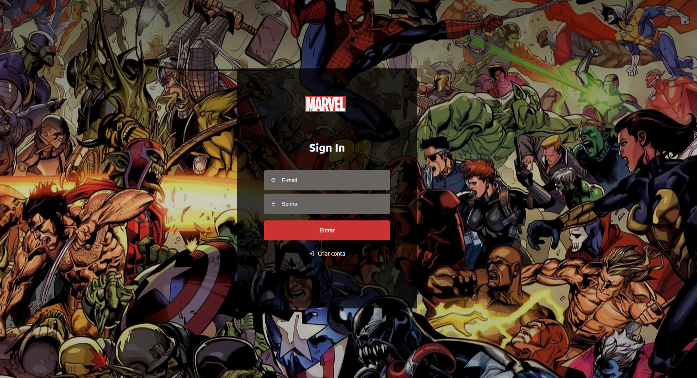
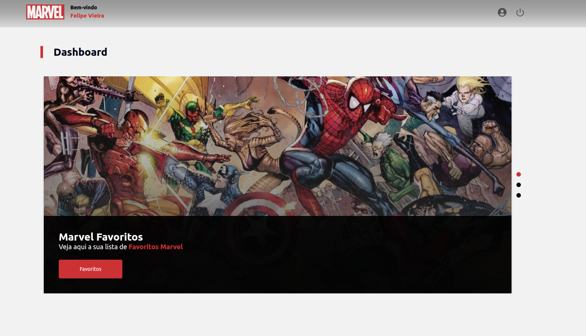
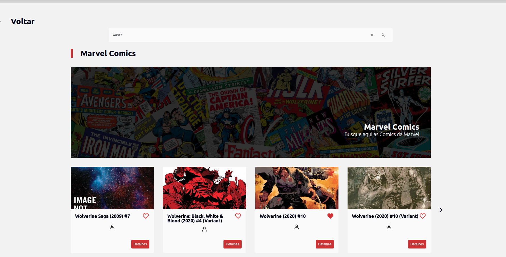
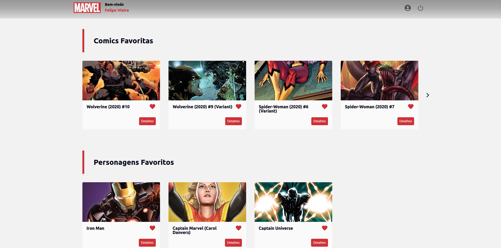
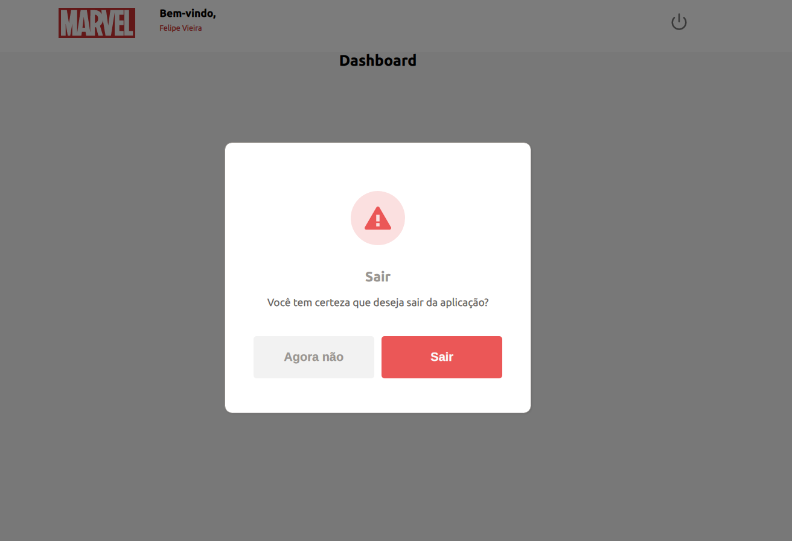

<h3 align="center">
  Marvel Client
</h3>

<p align="center">Este projeto se propós a realizar a integração de serviços do frontend Marvel com o backend Marvel Api, realizando a chamadas, consumindo serviços da API da Marvel.</p>

<p align="center">
  <a href="#computer-frontend">Frontend</a>
</p>

# :coffee: Demonstrações

<div>
  <p align="center">
    
    
    
    
    
  </p>
</div>

### Pré-requisitos

Antes de começar, você vai precisar ter instalado em sua máquina as seguintes ferramentas:
[Git](https://git-scm.com), [Node.js](https://nodejs.org/en/).
Além disto é bom ter um editor para trabalhar com o código como [VSCode](https://code.visualstudio.com/)

# Informações adicionais

Neste projeto decidir por utilizar o React com TypeScript, pois para mim o TypeScript torna o projeto mais legível por conta de sua tipagem assim evitando alguns erros que possam ocorrer com o JavaScript. <br/><br/>
Foi utilizado também o styled-components como lib de estilo, para facilitar e organizar as folhas de estilo, e também para entregar maior poder de personalização, com isso foi criado um Design System da aplicação, storybook para realizar a documentação de alguns componentes, e Jest para realizar alguns teste de render.

# :computer: Frontend

Após clonar o repositório, entre na pasta `marvel-client` e instale todas as dependências utilizando o comando:

```bash
# Digite o comando abaixo para instalar as dependências:
yarn install
```

Depois, digite o comando abaixo para rodar a aplicação web:

```bash
# Irá abrir em localhost:3000
yarn start
```

<br>

### 🛠 Tecnologias

As seguintes ferramentas foram usadas na construção do projeto:

- [React](https://pt-br.reactjs.org/)
- [TypeScript](https://www.typescriptlang.org/)
- [Styled Components](https://styled-components.com/)
- [Storybook](https://storybook.js.org/)
- [Jest](https://jestjs.io/)
- [ContextAPI](https://reactjs.org/docs/context.html)

### Autor

---

<div align="center">
<a href="https://2lipe.netlify.app/" target="_blank">
 
 <br />
 <sub><b>Felipe Vieira</b></sub></a> <a href="https://2lipe.netlify.app/" target="_blank" title="Felipe Vieira"></a>

Made by Felipe Vieira

</div>
